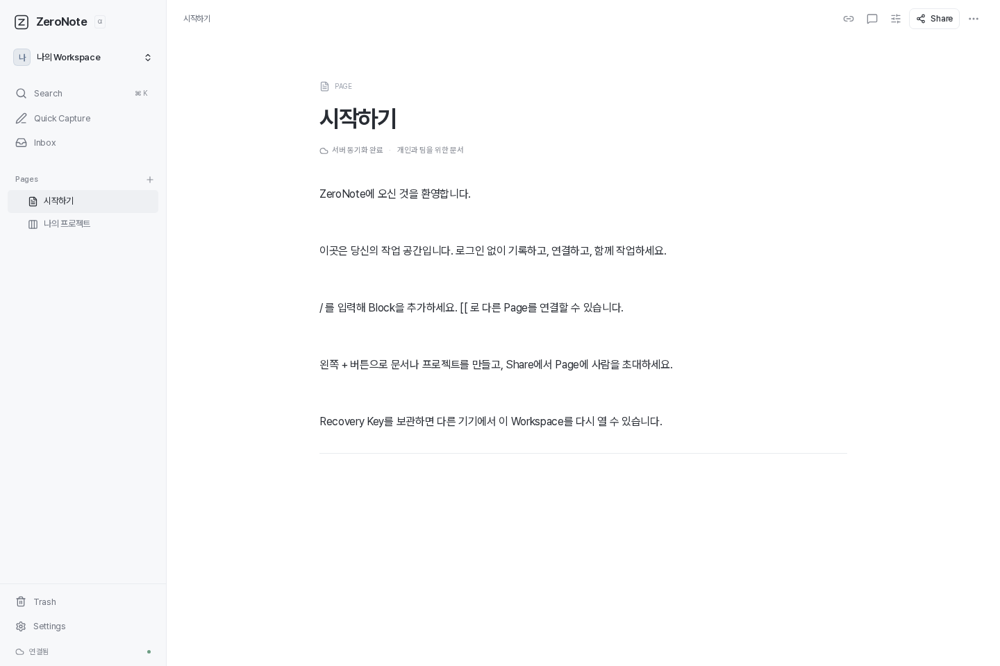
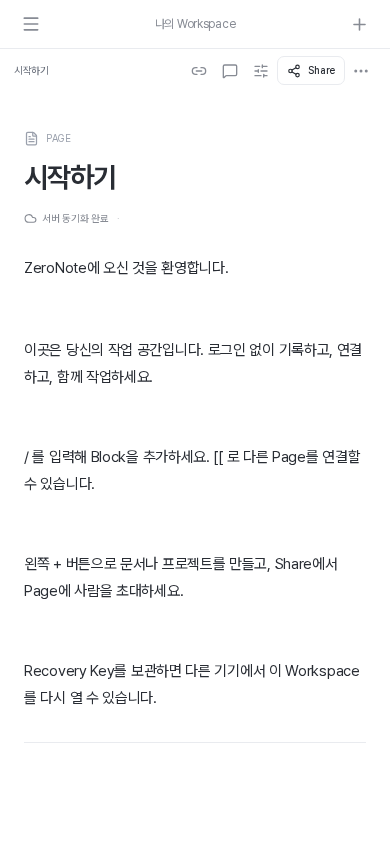

# ZeroNote Alpha 구현 및 검증 기록

검증일: 2026-10-01. 승인된 핵심 Alpha를 로컬에서 실행하고 실제 PostgreSQL 및 Browser로 검증했다. Calendar, 일반 Property Builder, Branch/Merge, Public/Burn Share, 파일 업로드, Automation, Native Desktop은 Deferred다.

## 실행 환경

| 항목             | 검증 환경                                                        |
| ---------------- | ---------------------------------------------------------------- |
| Runtime          | Node.js 24.14.1, pnpm 11.9.0                                     |
| Web              | Next.js 16.3.8 / React 19, Production Build                      |
| Database         | PostgreSQL 14.24, WSL/Linux의 독립 개발 Cluster, 127.0.0.1:55432 |
| Browser          | Playwright Chromium 153.0.8010.12, Headless                      |
| Desktop / Mobile | 1440×960 / 390×844 Viewport                                      |
| Preview          | Web localhost:3000 / API localhost:3001                          |
| E2E              | 별도 Build `.next-e2e`, Web localhost:3002 / API localhost:3003  |

## 검증 명령

| 명령                         | 결과                                                                                           |
| ---------------------------- | ---------------------------------------------------------------------------------------------- |
| `pnpm lint`                  | 통과                                                                                           |
| `pnpm type-check`            | Web·Server·Shared·테스트 TypeScript 검증 통과                                                  |
| `pnpm test`                  | 4개 파일, 59개 단위·Local-first·PostgreSQL·WebSocket 테스트 통과                               |
| `pnpm test:e2e`              | 7개 통과; HTML Paste와 Mobile Touch·Focus·Comment 전송을 강화한 두 시나리오도 각각 재실행 통과 |
| `pnpm build`                 | Web Production Build와 Server TypeScript 검증 통과                                             |
| `pnpm start` 및 `/v1/health` | Preview 실행, 같은 Origin API Proxy 200 응답 확인                                              |

테스트는 자체 생성한 Workspace만 정리한다. 브라우저의 두 기기는 서로 분리된 Browser Context로 재현했다. Preview에서 만든 화면 검증용 Workspace도 삭제했다.

## 확인한 동작

| 범위                 | 검증 근거                                                                                                                                               |
| -------------------- | ------------------------------------------------------------------------------------------------------------------------------------------------------- |
| Workspace / Identity | P-256 Challenge 서명, Replay·잘못된 서명·만료 거절, Workspace 생성·복구, 잘못된 Recovery Key 거절, Key 재발급·기기 철회                                 |
| Editor / 지식 연결   | Markdown Heading 변환, Slash Todo, Page Mention의 안정적인 ID, Rename 후 링크·Backlinks 유지, Todo → Task 변환                                          |
| 실시간 협업          | 실제 WebSocket에 5개 Editor 연결, 동시 편집·Offline 재접속 상태 수렴, Yjs Undo가 원격 변경을 보존                                                       |
| 권한 / 초대          | Viewer·Commenter의 REST와 WebSocket 쓰기 차단, 검증된 Presence Identity, 초대 동시 수락·한 번 사용·동일 기기 재시도·만료·취소·하위 Page 범위·Grant 철회 |
| Local 저장           | 실제 Browser Offline 작성·새로고침·재접속, IndexedDB Quota 오류 시 성공 표시 없이 메모리 내용 보존, 접근 철회·원격 삭제 후 미전송 문서 보존             |
| Task                 | Table / Board 데이터 일치, Status 이동, 상세 Properties, 날짜 전용 값 검증, 다른 Property의 동시 변경 병합, 1,000 Rows Pagination                       |
| Comments / Capture   | 협업자의 Page Comment, Offline Comment Queue 재전송, Inbox 저장, 여러 줄 입력, Ctrl+Enter 저장, Mobile Capture·Comments                                 |
| 데이터 이전          | Browser 다운로드·Import, 문서·Task 보존, Page Mention ID 재매핑, 인증 Secret 제외, 잘못된 버전·바이너리·중복 ID·Tree 순환 거절, 최대 길이 이름 Import   |
| 보안 입력            | Origin 검사, Script/Data URL 거절, HTML Paste의 Script·이벤트 Attribute·실행 URL 제거 및 정상 HTTPS 링크 보존                                           |

WebSocket에서 Workspace 정리 후 접근 거절 로그가 발생할 수 있다. 삭제된 문서에 대한 이후 메시지를 차단한 결과이며 테스트 실패가 아니다. 요청 Body와 Recovery/Invite Secret은 로그에 출력하지 않는다.

서버 저장 실패 검증에서는 PostgreSQL Repository에 저장 오류를 주입했다. API가 500 응답을 반환하고 Durable Ack를 보내지 않으며 원격 문서 내용이 변경되지 않는 것을 확인했다. 같은 Operation ID로 재시도하면 한 번 저장되고 Durable Ack를 받는다.

## 성능 측정

테스트 데이터는 Workspace의 캐시된 1,000 Pages, 500 Blocks 문서, Task Database의 1,000 Rows다. 페이지를 Offline 상태로 열어 네트워크 영향을 제외했다. 5명 동시 편집은 별도의 실제 WebSocket 통합 테스트로 검증했다.

| 지표                   | 마지막 전체 E2E 측정 | 목표         | 결과 |
| ---------------------- | -------------------- | ------------ | ---- |
| 캐시 문서 열기         | 800ms                | 1,000ms 미만 | 통과 |
| Local Search 결과 표시 | 28ms                 | 200ms 미만   | 통과 |

측정 시작은 Browser 안의 Click/Input Event이고, 종료는 해당 문서의 마지막 Block 또는 검색 결과가 DOM에 나타난 후 두 번째 Animation Frame이다. Playwright의 Locator 탐색·Actionability 대기·프로세스 간 통신 시간은 UI 측정에서 제외하고 별도로 기록했다. 같은 실행의 자동화 전체 시간은 문서 약 992ms, 검색 약 305ms였다. 이전 독립 실행은 문서 약 543ms, 검색 약 85ms였다. 이 수치는 해당 Headless 환경의 단일 실행이며 모든 기기에서의 지연 보장은 아니다.

원시 수치는 [alpha-performance.json](alpha-performance.json), 시나리오는 [performance.spec.ts](../tests/performance.spec.ts)에 있다.

## 검증 한계

- Docker 실행 경로가 끊겨 있어 Docker Build·Compose 실행은 검증하지 못했다. 대신 Native PostgreSQL에서 실제 API·WebSocket 저장 및 복구를 검증했다. Dockerfile·Compose와 PostgreSQL 17 기반 CI 설정은 제공했다.
- Firefox·WebKit, 실제 iOS/Android 기기, HTTPS Production 환경 및 공개 배포는 검증하지 않았다. Mobile 검증은 Chromium의 Viewport와 Touch UI 흐름 기준이다.
- Offline 첫 방문과 아직 캐시하지 않은 문서는 지원 범위 밖이다. 서버 Recovery는 서버에 동기화된 데이터까지만 복구한다.
- Task Comments는 해당 Database Page의 Thread에 저장한다. Row별 권한과 Row별 Comment 범위는 후속 기능이다.
- CRDT Update 로그 압축·정리와 대규모 파일 저장은 Alpha 이후 운영 단계에서 추가한다.

## 주요 신규 파일과 목적

빈 프로젝트에서 다음 실행 파일·문서·테스트를 생성했다. 라이브러리 설치물과 Build 산출물은 제외한다.

| 파일                                                                      | 생성 이유                                                         |
| ------------------------------------------------------------------------- | ----------------------------------------------------------------- |
| `package.json`, `pnpm-workspace.yaml`, `pnpm-lock.yaml`                   | 독립 Monorepo와 재현 가능한 의존성·검증 명령                      |
| `tsconfig.base.json`, `tsconfig.tests.json`, 각 Package의 `tsconfig.json` | 엄격한 TypeScript 및 테스트 Type 검사                             |
| `eslint.config.mjs`, `vitest.config.ts`, `playwright.config.ts`           | 코드 규칙, 단위·통합·Browser 검증                                 |
| `.gitignore`, `.dockerignore`, `.env.example`                             | 산출물·Secret 제외와 환경변수 안내                                |
| `Dockerfile`, `compose.yaml`, `.github/workflows/ci.yml`                  | 배포 실행 정의와 PostgreSQL 기반 CI                               |
| `scripts/postgres.mjs`                                                    | Docker 대신 실행 가능한 독립 Native PostgreSQL Cluster            |
| `scripts/dev.mjs`, `scripts/start.mjs`                                    | Web·API 실행과 종료, Production API 준비 후 Web 시작              |
| `scripts/e2e.mjs`, `scripts/e2e-start.mjs`                                | Offline 검증용 Production Build와 독립 테스트 포트                |
| `packages/shared/src/index.ts`                                            | Client·Server 공통 Zod 계약, Role·Task·Yjs Projection·Export 검증 |
| `packages/shared/src/index.test.ts`                                       | 날짜·권한·바이너리·Task 병합·Projection·Secret 제외 검증          |
| `apps/server/src/database/schema.sql`                                     | Entity·Relation·Index·삭제 정책 정의                              |
| `apps/server/src/database/repository.ts`                                  | 트랜잭션, Metadata 중복 방지, CRDT Update·Checkpoint 저장         |
| `apps/server/src/env.ts`, `migrate.ts`, `index.ts`                        | 환경 검증, Migration, 서버 실행                                   |
| `apps/server/src/app.ts`, `routes.ts`                                     | REST·WebSocket 연결, Origin·Rate Limit·오류 처리                  |
| `apps/server/src/services.ts`                                             | Device 인증, Recovery, 권한, 초대, 문서·Comments 업무 규칙        |
| `apps/server/src/realtime.ts`                                             | 문서별 인증·쓰기 제한·Presence 검증·PostgreSQL 저장               |
| `apps/server/src/integration.test.ts`, `realtime.test.ts`                 | 실제 PostgreSQL·REST·WebSocket 정상 및 실패 시나리오              |
| `apps/web/next.config.ts`, `postcss.config.mjs`                           | 같은 Origin Proxy와 Tailwind·Build 설정                           |
| `apps/web/src/app/layout.tsx`, `page.tsx`, `globals.css`                  | 앱 진입, Pretendard, Design Tokens, Theme·반응형 UI               |
| `apps/web/src/fonts/PretendardVariable.woff2`, `LICENSE`                  | Offline에서도 사용 가능한 자체 제공 폰트와 SIL OFL                |
| `apps/web/src/components/workspace-app.tsx`, `sidebar.tsx`                | Workspace·Page Tree·Inbox·Trash·모바일 Drawer                     |
| `apps/web/src/components/document-view.tsx`                               | 문서·Task 상세, Presence, 정확한 저장 상태, 로컬 보존본           |
| `apps/web/src/components/block-editor.tsx`, `editor-nodes.tsx`            | Tiptap Blocks, Markdown·Slash·Mention, Code Highlight·Task Link   |
| `apps/web/src/components/task-database.tsx`                               | 같은 Yjs Task 데이터의 Table·Board·Pagination                     |
| `apps/web/src/components/context-panel.tsx`                               | Comments·Properties·Backlinks·Share 전환                          |
| `apps/web/src/components/dialogs.tsx`, `primitives.tsx`                   | Recovery·Capture·Search·Settings와 Dialog Focus 관리              |
| `apps/web/src/lib/api.ts`, `database.ts`, `documents.ts`                  | 기기 인증, Dexie·y-indexeddb·Yjs 로컬 저장과 문서 세션            |
| `apps/web/src/lib/sync.ts`, `workspace.ts`                                | Operation Queue·Revision 충돌·Commit 확인·Export/Import           |
| `apps/web/src/lib/search.ts`, `hooks.ts`, `ui-store.ts`                   | 로컬 검색·접근 범위·Metadata 구독·UI 상태                         |
| `apps/web/src/lib/offline-shell.ts`, `public/sw.js`                       | App Shell·정적 Asset Cache와 Offline 새로고침                     |
| `apps/web/public/manifest.webmanifest`, `icon.svg`                        | Web App 이름·아이콘                                               |
| `apps/web/src/lib/local-first.test.ts`                                    | Offline Queue·검색·Import·Quota·접근 철회 후 데이터 보존          |
| `tests/workspace.spec.ts`, `performance.spec.ts`                          | 대표 사용자 흐름과 1,000 Pages/Rows 성능 측정                     |
| `docs/product/00-product-vision.md`                                       | 제품 비전과 Alpha 성공 기준                                       |
| `docs/product/01-personas-jtbd.md`                                        | 사용자와 해결할 작업                                              |
| `docs/product/02-product-requirements.md`                                 | Trigger·Behavior·Offline·Sync·Error·Acceptance 계약               |
| `docs/product/03-information-architecture.md`                             | 탐색·화면·Context Panel 구조                                      |
| `docs/product/04-user-flows.md`                                           | Entry·Steps·Success·Error·Edge 흐름                               |
| `docs/product/05-editor-spec.md`                                          | Block·Markdown·Slash·Mention·Undo 명세                            |
| `docs/product/06-database-spec.md`                                        | 고정 Task Property·Table·Board·변환 명세                          |
| `docs/product/07-collaboration-spec.md`                                   | 공동 편집·Presence·Comments 명세                                  |
| `docs/product/08-permission-model.md`                                     | Role·Capability·초대 범위·철회 명세                               |
| `docs/product/09-local-first-sync.md`                                     | Local 저장·Queue·Commit·실패 복구 계약                            |
| `docs/product/10-security-model.md`                                       | Identity·복구·Secret·권한의 신뢰 경계                             |
| `docs/product/11-versioning-branching.md`                                 | Alpha 범위와 후속 Snapshot·Branch 순서                            |
| `docs/product/12-ui-ux-spec.md`                                           | Desktop·Mobile·Focus·상태 표시 규칙                               |
| `docs/product/13-design-system.md`                                        | Pretendard·색·크기·Theme·접근성 기준                              |
| `docs/product/14-technical-architecture.md`                               | Web·Backend·CRDT·Local 저장 책임 분리                             |
| `docs/product/15-data-model.md`                                           | Entity 소유권·Relation·삭제 정책                                  |
| `docs/product/16-api-design.md`, `docs/api.md`                            | 공유 계약과 실제 `/v1` Endpoint·Role                              |
| `docs/product/17-performance-requirements.md`                             | 측정 Dataset·지연 목표                                            |
| `docs/product/18-roadmap.md`                                              | Alpha와 후속 기능 Dependency                                      |
| `docs/product/19-decision-log.md`                                         | Confirmed 답변·Accepted 기본안·Deferred 구분                      |
| `docs/product/20-open-questions.md`                                       | 후속 선택과 환경 검증 항목                                        |
| `README.md`, `docs/validation.md`, `docs/alpha-performance.json`          | 실행 안내·검증 근거·실제 측정 결과                                |
| `docs/assets/alpha-desktop.png`, `alpha-mobile.png`                       | 실제 Production UI 화면 기록                                      |

## 실제 화면

Desktop:

Mobile:

